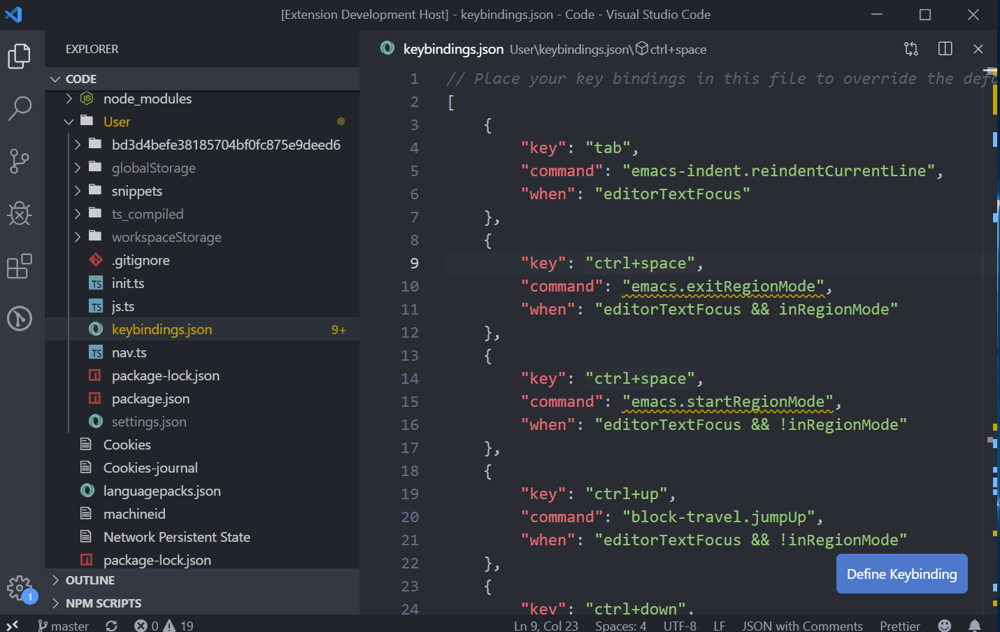

# vscode-ido

File navigation extension inspired by Helm and ido mode in Emacs.

## Features

Quickly navigate and create files with the keyboard.

Jump to parent folder directory with `ido-go-up-directory` (bound to Ctrl+l by default).

Enter currently selected directory or open file with `ido-select-item` (bound to Ctrl-j/Enter by default).

Create a file by entering a path that doesn't already exists. Ido will automatically create missing subdirectories for you!
